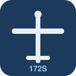

# Cessna 172S G1000 Flight Simulator

A flight simulator for the **Cessna 172S Skyhawk** with a **Garmin G1000**-style
glass cockpit, built with the **Godot 4** engine. It balances *aerodynamic
realism* (a physics-based flight model validated against the C172S POH) with
*playability* (forgiving controls, always-visible instruments, instant replay,
one-key reset). Runs on **macOS**, Linux and Windows.



---

## Highlights

- **POH-validated flight model** — body-axis aerodynamics with a custom
  integrator at 120 Hz. Validated headless against book numbers:
  takeoff roll ~240 m (rotate 55 KIAS), Vy climb ~790 fpm, full-throttle
  cruise ~122 KTAS, power-off stall ~49 KIAS.
- **Single-engine character** — propwash over the tail (elevator/rudder
  authority at low speed), spiral slipstream + P-factor + engine torque
  (takeoff needs right rudder), ground effect (it floats in the flare),
  pre-stall buffet, and fading aileron authority near the stall.
- **Three-point gear physics** — nose wheel, mains and a tail-strike skid are
  independent spring/damper contacts with tire cornering grip, brakes on the
  mains only, and rudder-pedal nosewheel steering that washes out with speed.
- **Wind, gusts and turbulence** — boundary-layer wind profile, gusts, and a
  spatio-temporal turbulence field sampled at the wingtips and tail so bumps
  come from gradients in the air. Five presets (calm → 18G30) cycled with `V`,
  including direct-crosswind setups for landing practice.
- **Glass cockpit** — G1000-style PFD (attitude, airspeed/altitude tapes with
  V-speed arcs, VSI, HSI, wind data box) and MFD (engine gauges in US units +
  heading-up moving map with runway, pattern and true ground track), shown as
  corner overlays in every view and on the 3D panel in the cockpit.
- **Instant replay** — the whole flight is recorded (~11 min ring buffer).
  `Tab` replays it with pause/scrub/speed control and a mouse-orbit camera;
  a floating tag shows glide angle, AGL and load factor.
- **Traffic-pattern instructor** — `src/training/PatternPilot.gd` flies a
  textbook left-hand pattern (takeoff → crosswind → downwind → base → final →
  full-stop landing) with bilingual lesson captions and camera direction.
- **Procedural everything** — aircraft model, airport (runway markings,
  taxiway, hangar, tower), countryside and all instruments are built in code;
  no external assets.

---

## Requirements

- **Godot Engine 4.3 or newer** — standard (GDScript) build, *not* the
  .NET/C# build. Download from <https://godotengine.org/download>.
- macOS 11+ (Apple Silicon or Intel), Linux, or Windows.

## Running on macOS

1. Install Godot 4 (drag `Godot.app` to `/Applications`).
   - If Gatekeeper blocks the first launch: right-click → **Open**, or allow it
     under *System Settings → Privacy & Security*.
2. Launch Godot, choose **Import**, and select this folder's `project.godot`.
3. Press **▶ (Run Project)** / `F5`.

From the command line:

```bash
godot --path /path/to/this/repo                                  # brew install godot
/Applications/Godot.app/Contents/MacOS/Godot --path /path/to/this/repo
```

To export a standalone `.app`: **Project → Export → Add… → macOS**.

---

## Controls

| Action              | Keys                                   |
|---------------------|----------------------------------------|
| Pitch               | `↑` / `↓` (up = nose down, like a yoke)|
| Roll                | `←` / `→`                              |
| Yaw (rudder)        | `Z` / `X`                              |
| Throttle            | `=` / `-`  (also `W`/`S`, `PgUp`/`PgDn`)|
| Elevator trim       | `,` / `.`                              |
| Flaps down / up     | `F` / `G`                              |
| Wheel brakes        | `B` (toggle)                           |
| Cycle camera view   | `C` (cockpit → chase → wing → tower)   |
| Cockpit look around | hold **right mouse** and drag          |
| Wind preset         | `V` (shown in the PFD wind box)        |
| Reset on runway     | `R`                                    |
| **Replay**          | `Tab` enter/exit                       |
| — pause             | `Space`                                |
| — scrub             | `←` / `→`                              |
| — speed             | `↑` / `↓` (0.25×–4×)                   |
| — orbit camera      | drag **left mouse**, wheel to zoom     |

### Suggested first flight

1. Full throttle (`=`), keep the centreline with gentle rudder (`Z`/`X`).
2. At **55 KIAS** ease back (`↓`) to rotate; climb at **74 KIAS** (Vy).
3. Trim (`,`/`.`) for the climb, level off, ~75 % power to cruise.
4. To land: slow below **85 KIAS**, flaps in stages (`F`), fly final at
   **65 KIAS**, idle over the numbers, flare, brake (`B`).
5. Press `Tab` to review the whole flight in replay.

### Watching the pattern lesson

Add `src/training/PatternPilot.gd` as an autoload (Project Settings →
Globals → Autoload) and run: the aircraft flies a complete narrated traffic
pattern by itself, then remove the autoload to fly manually again.

---

## Project layout

```
project.godot                 Engine config, input map, autoloads
src/
  Main.tscn / Main.gd         Top-level scene: world + aircraft + camera + UI
  systems/
    Atmosphere.gd             ISA atmosphere (autoload)
    FlightData.gd             Shared flight-state blackboard (autoload)
    Wind.gd                   Wind / gusts / turbulence field (autoload)
    Replay.gd                 Flight recorder + instant replay (autoload)
    AudioManager.gd           Procedural engine/wind/stall audio (autoload)
    InputSetup.gd             Key bindings, registered in code (autoload)
    TestPilot.gd              POH validation harness (opt-in autoload)
  aircraft/
    Aircraft.tscn/.gd         Flight dynamics, 3-point gear, propulsion coupling
    Engine.gd                 Lycoming IO-360 + fixed-pitch prop model
    Airframe.gd               Procedural exterior (lofted fuselage, surfaces)
    Cockpit.gd                3D panel with live G1000 screens (SubViewports)
    Propeller.gd              Spinning prop + blur disc
    ReplayAnnotation.gd       Floating glide/AGL/G tag during replay
  ui/
    PFD.gd / MFD.gd           G1000 displays (procedural, used 2D + on panel)
    StandbyGauges.gd          Backup steam gauges on the panel
    ReplayHUD.gd              REC dot + replay transport bar
    UiFont.gd                 Shared system-font helper
  world/
    World.tscn / World.gd     Runway, markings, airport, countryside, sky
    CameraController.gd       View cycling + replay orbit camera
  training/
    PatternPilot.gd           Instructional traffic-pattern autopilot
```

## Flight-model notes & limitations

A *lumped-parameter* model with constant stability derivatives, tuned to the
C172S POH — not blade-element or CFD. It captures stalls (with buffet and a
proper post-stall break), trim, climb/cruise/ground-roll performance,
left-turning tendencies, ground effect, wind/gusts/turbulence and three-point
ground handling. Not modelled (yet): spins, icing, mixture/leaning effects,
systems failures, and asymmetric stall/wing drop.

## License

See [LICENSE](LICENSE).
