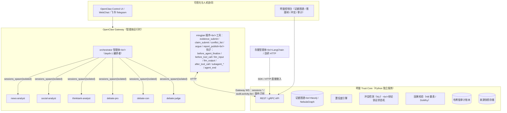

# 「明鉴」基于 OpenClaw / LoopClaw 的落地方案

> 配套文档：[《多智能体可信研判系统-揭榜方案》](./多智能体可信研判系统-揭榜方案.md)
> 本文回答两个问题：**LoopClaw 能否做这件事？如果用 OpenClaw 生态做，怎么做？**
> 版本：v1.0 · 2026 年 9 月

---

## 〇、结论先行

| 问题 | 结论 |
| --- | --- |
| **LoopClaw 能否直接做「多智能体可信研判系统」？** | **不能。** LoopClaw（npm 包名 `lobster-perpetual-engine`）是 OpenClaw 的一个插件，定位是"零延迟永续循环 Agent 引擎"：一个 `while(isRunning)` 死循环持续执行 `MISSION_PARTNER.md` 里的任务清单，内置 AST 缓存、代码分析、自动修复、熔断与状态持久化，通过 Telegram / Discord 的 `/start_partner` 等命令操作。它是**单智能体的自主编码搭档**，不提供多智能体协同、证据图谱、置信度、冲突消解、因果校验或防篡改审计中的任何一项。项目仅 5 次提交、0 star、单作者，不具备作为企业级底座的成熟度。 |
| **它所依附的 OpenClaw 能否做？** | **能承担"多智能体运行时 + 接入与审计钩子"这一层，且贴合度很高。** OpenClaw 原生具备：多智能体隔离（独立工作区 / 模型 / 会话库 / 沙箱）、子智能体派生（`sessions_spawn`，可隔离上下文、可编排两层）、智能体间通信白名单、可拦截可阻断的插件钩子（`before_tool_call`、`before_agent_finalize`、`llm_input` / `llm_output` 等）、Gateway WebSocket 协议（会话 / 工具调用 / 审计活动查询）、逐会话落盘的对话转录、私有化模型接入（vLLM / Ollama / OpenAI 兼容 / DeepSeek / Qwen）。 |
| **OpenClaw 缺什么？** | 证据图谱、置信度引擎、NLI 冲突检测、辩论协议、因果校验、哈希链防篡改审计、可视化面板——即「明鉴」的**可信研判核心层**。这些必须由我们实现，作为独立服务（Trust Core）+ 一个 OpenClaw 插件（`mingjian`）接入。 |
| **推荐路径** | **OpenClaw 做智能体运行时，「明鉴」Trust Core 做独立服务，两者通过 `mingjian` 插件对接。** LoopClaw 不作为依赖，只借鉴其"常驻服务 + 熔断 + 状态持久化"的插件写法，用于可选的"持续研判守护进程"。 |

---

## 一、LoopClaw 与 OpenClaw 是什么

### 1.1 LoopClaw（`johnny-worktree-agent/loopclaw`）

- **本质**：OpenClaw 插件，`package.json` 中 `openclaw.id = lobster-perpetual-engine`，入口 `dist/plugin.js`，Node.js ≥ 20 + TypeScript，MIT 协议，无生产依赖。
- **做的事**：注册一个后台服务（`api.registerService`），在 `gateway_start` 时自动启动一个不 sleep、无心跳的永续循环；每轮循环读取 `MISSION_PARTNER.md`（编号任务 = 无限循环，Markdown 复选框 = 有限任务完成即停），调用模型做代码分析 / 修复 / 任务规划；错误分类（file_io / parse / network / permission / timeout）后转为下一轮提示词；指数退避 1s→60s，连续失败 10 次熔断，300s 无进展自动停。
- **暴露接口**：`/start_partner`、`/stop_partner`、`/partner_status`、`/partner_mission`、`/partner_analyze`、`/partner_compress`、`/partner_voice_report` 七个命令；可选注册 `/lobster/status`、`/lobster/health` HTTP 路由与 Gateway RPC 方法。
- **成熟度**：5 次提交、0 star、单作者，面向"自主编码搭档"场景。

**判断**：LoopClaw 与榜题需求正交。它解决的是"一个智能体如何不停地干活"，榜题要解决的是"多个智能体的结论如何可信、可溯、可对质"。

### 1.2 OpenClaw（`openclaw/openclaw`）

- **本质**：自托管的个人 AI 助手框架，MIT 协议，由 OpenClaw Foundation 维护，800+ 贡献者。核心是一个 **Gateway 守护进程**（默认 `127.0.0.1:18789`），统一管理消息渠道（WhatsApp / Telegram / Slack / Discord / 飞书等）、会话、工具、事件与插件。
- **对本方案有价值的原生能力**（均来自其官方文档）：

| 能力 | OpenClaw 原生机制 | 对应「明鉴」需求 |
| --- | --- | --- |
| 多智能体隔离 | `agents.entries.<id>`：独立 workspace（`AGENTS.md` / `SOUL.md`）、独立 `agentDir` 与 SQLite 会话库、独立模型、独立技能白名单、独立沙箱与工具白名单 | 各研判智能体独立研判、防结论互相污染 |
| 子智能体派生 | `sessions_spawn({task, agentId, model, context: "isolated" \| "fork", runTimeoutSeconds})`，`maxSpawnDepth` 最高 5（=2 即"主 → 编排者 → 工人"），`maxConcurrent` 默认 8，`maxChildrenPerAgent` 默认 5（1–20）；结果经 announce 链回传，父智能体用 `sessions_yield` 等待 | 编排器分解专题、并行派发独立研判、组织辩论 |
| 智能体间通信 | `tools.agentToAgent.enabled + allow[]` 白名单 | 交叉质证、辩论回合 |
| 可阻断钩子 | `before_agent_run`（Gate）、`before_tool_call`（Gate/Modify，可 `block` 或 `requireApproval`）、`before_agent_finalize`（可返回 `action: "revise"` 要求模型重写，`maxAttempts`）、`before_message_write` / `tool_result_persist`（同步改写落盘内容） | **"无证据、不结论"硬约束**、论点必须引用证据节点、快照哈希注入 |
| 可观测钩子 | `llm_input` / `llm_output`（完整提示与输出）、`model_call_started/ended`、`after_tool_call`、`subagent_spawned/ended/progress`、`agent_end`、`message_sent` | 100% 审计埋点、推理轨迹采集 |
| Gateway 协议 | WebSocket JSON 帧（协议 v4）：`sessions.*`、`chat.*`、`tools.invoke`、`agents.*`、`approval.resolve`、`audit.activity.list`、事件订阅（`session.message` 等），scope 分级授权 | 外部 Trust Core / 控制台驱动智能体、订阅转录 |
| 转录持久化 | 每会话转录落盘，写入需持有 `activeWriterRunId` 声明；子智能体转录删除后仍以 `*.deleted.<ts>` 保留 | 可复现回放的原始素材 |
| 模型接入 | Ollama、vLLM、OpenAI 兼容端点、DeepSeek、Qwen；按智能体 / 子智能体分别指定模型与思考等级 | 私有化部署、"小模型初筛 + 大模型仲裁"分层 |
| 记忆 | 工作区 Markdown（`MEMORY.md`、`memory/YYYY-MM-DD.md`）+ `memory_search` 混合检索；`memory-wiki` 插件支持 claim 跟踪、矛盾检测、来源标注、按智能体分库 | 信源注册库、跨会话研判记忆 |
| 沙箱与治理 | 每智能体 `sandbox.mode: "all"`、`tools.allow/deny`（全局与局部双重门禁，局部只能收紧）、设备配对、`before_install` 扫描 | 企业落地的安全基线 |
| 部署 | macOS / Linux / Windows / Docker / Nix | 容器化交付 |

- **需要清醒看到的短板**：OpenClaw 起源于个人助手场景，2026 年以来有多篇安全分析论文指出其框架与变体的攻击面（提示注入、工具滥用、渠道配对等）；插件钩子契约仍在快速演进；Gateway 的 `audit.activity` 是活动日志而非防篡改账本；子智能体结果默认以文本 announce 回传而非结构化对象。这些都能通过下文的架构设计规避。

---

## 二、落地路径比较

| 路径 | 说明 | 优点 | 风险 | 判断 |
| --- | --- | --- | --- | --- |
| **A. 纯 OpenClaw + 插件** | 证据图谱、置信度、辩论、审计全部写进一个 OpenClaw 插件（Node/TS） | 一体化部署 | 图算法、NLI、DoWhy 等 Python 生态难以在 Node 插件内落地；Gate 钩子默认 15s 超时，重计算放进钩子会拖垮主循环；与 OpenClaw 版本强耦合，被"接入不了 OpenClaw 的存量智能体"排除在外 | 不推荐 |
| **B. OpenClaw 运行时 + 独立 Trust Core 服务（推荐）** | OpenClaw 负责智能体运行、派生、通信、钩子拦截；Trust Core（Python）负责图谱 / 置信度 / 冲突 / 因果 / 哈希链 / 面板；`mingjian` 插件做桥接（工具 + 钩子） | 各取所长；Trust Core 对 OpenClaw 无依赖，存量 LangChain / 自研智能体仍可经 HTTP 直接接入，保住"落地可用性"；OpenClaw 若被替换，可信底座不受影响 | 两种语言、两个进程；需约定结构化协议 | **推荐** |
| **C. 不用 OpenClaw，自研编排** | 即原揭榜方案的自研轻量编排内核 | 完全可控、确定性图工作流 | 从零实现多智能体隔离、派生、渠道、控制台，工作量大 | 备选；若发榜方对 OpenClaw 的安全态势不接受时切换 |

选择 B 的关键理由：它把「明鉴」的核心资产（Trust Core）放在 OpenClaw 之外，OpenClaw 只是"最贴合的第一个运行时"，而不是唯一运行时。

---

## 三、目标架构（路径 B）



**职责边界**

| 层 | 承担者 | 说明 |
| --- | --- | --- |
| 智能体运行、隔离、派生、通信、渠道 | OpenClaw | 不改 OpenClaw 源码，只用配置 + 插件 |
| "无证据、不结论"等硬约束的**执行点** | `mingjian` 插件钩子 | 钩子只做快速校验与转发（毫秒级），重计算不放钩子 |
| 图谱、置信度、冲突、辩论裁决逻辑、因果、审计账本、快照 | Trust Core | 与 OpenClaw 解耦，存量智能体直接接入 |
| 面板 | 明鉴控制台（独立前端） | 读 Trust Core API；操作员对话仍走 OpenClaw 自带界面 / IM 渠道 |

---

## 四、关键设计：「明鉴」六项能力如何落在 OpenClaw 上

### 4.1 多智能体独立研判与编排

- **智能体清单**（`agents.entries`）：`orchestrator`（编排者）、`news-analyst` / `social-analyst` / `thinktank-analyst`（研判工人）、`debate-pro` / `debate-con` / `debate-judge`（辩论角色）、`causal-reviewer`（因果评审）。每个智能体独立 workspace，`AGENTS.md` 写清角色纪律与必须调用的工具；工人与辩手 `tools.deny: ["exec", "browser", "message", "cron"]`，仅允许 `web_fetch`、`memory_*` 与 `mingjian` 工具。
- **独立研判**：编排者以 `sessions_spawn({ agentId: "news-analyst", context: "isolated", task })` 并行派发，`context: "isolated"` 保证工人看不到彼此的输出与编排者的上下文——这是"独立评估"纪律的机制化。
- **编排深度**：`agents.defaults.subagents.maxSpawnDepth: 2`，主会话 → orchestrator → 工人 / 辩手；`allowAgents` 白名单限定可派生对象；`maxConcurrent` 依机器算力调到 8–12。
- **结果回传**：不依赖 announce 的自由文本。工人必须通过 `claim_submit` / `evidence_submit` 工具把结构化贡献写入 Trust Core，announce 文本只作为"完成信号"；编排者收到完成事件后从 Trust Core 拉取结构化结果。

### 4.2 证据链自动构建

- `evidence_submit({ claim_id, text_span, source_url, quote_offset })` → 插件转发 Trust Core，Trust Core 抓取来源快照、计算 SHA-256、建 `Evidence → Source` 边，返回 `evidence_id`。
- `claim_submit({ statement, type, evidence_ids[], reasoning })` → Trust Core 校验每个 `evidence_id` 存在且验证器判定"蕴含"，否则拒绝并返回补证要求。
- **`before_agent_finalize` 钩子 = "无证据、不结论"的最后关口**：工人给出最终回复前，插件解析其回复中的结论句，与本会话已提交的 claim 对齐；发现未入图的结论即返回 `{ action: "revise", reason: "结论未挂接证据", retry: { instruction: "调用 claim_submit 并引用 evidence_id", maxAttempts: 2 } }`。两次仍不合规则标记该智能体贡献为"不合规"，不进入聚合。
- **存量智能体补建链**：不在 OpenClaw 内运行的智能体，把报告 POST 到 Trust Core `/ingest/report`，走原方案的"补建链"抽取流水线。

### 4.3 置信度计算

完全在 Trust Core 内实现（主观逻辑融合、Admiralty 信源分级、校准）。OpenClaw 侧只做两件事：
- 工人在 `evidence_submit` 时附带其对信源的初判等级（作为一个观测值，不作为最终值）；
- `llm_output` 钩子采集工人的自评置信度语句，作为校准数据集的一部分。

### 4.4 冲突检测与博弈消解

- 编排者在工人全部完成后调用 `conflict_list({ topic_id })`，Trust Core 用 NLI 返回冲突清单。
- 对需辩论的冲突，编排者派生 `debate-pro` / `debate-con` / `debate-judge` 三个隔离子会话，把冲突双方 claim 与证据包作为 task 注入。
- 辩手只能通过 `argue({ debate_id, round, stance, points[{ text, evidence_ids[] }] })` 发言；**`before_tool_call` 钩子（matcher: `["argue"]`）拦截无 `evidence_ids` 的论点，直接 `block`**，并把拦截事件写入审计——"论点必须引用证据节点"由机制而非提示词保证。
- `debate-judge` 通过 `judge_verdict` 提交裁决；Trust Core 记录 `DebateRecord`。轮次上限、不收敛保留分歧、人工升级，由 Trust Core 的辩论状态机控制；人工裁决走 OpenClaw 的 approval 流程（`before_tool_call` 返回 `requireApproval`，操作员在 Control UI / IM 内批复，`approval.resolve` 事件回流审计链）。

### 4.5 因果校验

- `causal-reviewer` 智能体对因果 claim 执行 Hill 量表评审并调用 `causal_grade` 工具提交各准则打分；数据路（DoWhy）在 Trust Core 内运行，不经过 LLM。
- `report_publish` 工具在发布前由 Trust Core 检查：L1 级因果 claim 若在文本中使用"导致 / 引发"措辞则拒绝发布并返回改写建议。

### 4.6 全程审计、可复现、可干预

- **埋点**：插件订阅 `llm_input`、`llm_output`（需 `plugins.entries.mingjian.hooks.allowConversationAccess: true`）、`model_call_started/ended`、`before_tool_call`、`after_tool_call`、`subagent_spawned/ended`、`agent_end`、`message_sent`、`session_start/end`，每个事件带 OpenClaw 的 `runId` / `sessionKey` / 子会话键（`agent:<agentId>:subagent:<uuid>`），POST 到 Trust Core `/audit/append`。
- **哈希链**：Trust Core 对事件做 `hash_n = SHA256(event_n ∥ hash_{n-1})`，周期性 Merkle 根锚定；OpenClaw 自身的 `audit.activity.list` 与落盘转录作为**第二独立来源**，`audit verify` 工具交叉比对两者，一致性本身即防篡改证据。
- **快照哈希注入**：`tool_result_persist`（同步）在 `web_fetch` 结果落盘前附加内容哈希与快照 id，使转录与图谱可互相印证。
- **可复现**：审计事件记录 `model_call_*` 中的 provider / model / 参数，配合 OpenClaw 转录与 Trust Core 保存的检索上下文，复现模式在 Trust Core 内重放。
- **可干预**：人工在明鉴控制台修订结论 / 否决裁决 → Trust Core 记录干预事件 → 通过 Gateway `chat.inject` / `sessions.send` 把干预结果注入编排者会话，继续流程。

---

## 五、配置与代码骨架

### 5.1 OpenClaw 配置（`openclaw.json5` 节选）

```json5
{
  agents: {
    defaults: {
      // 私有化模型：按 OpenClaw provider 配置命名，此处为示意
      model: "vllm/DeepSeek-V3",
      subagents: { maxSpawnDepth: 2, maxConcurrent: 10, maxChildrenPerAgent: 8, runTimeoutSeconds: 900 },
      sandbox: { mode: "all", scope: "agent" },
      tools: { deny: ["exec", "browser", "message", "cron", "gateway"] },
    },
    entries: {
      orchestrator: {
        workspace: "~/.openclaw/ws-orchestrator",
        subagents: { allowAgents: ["news-analyst", "social-analyst", "thinktank-analyst",
                                   "debate-pro", "debate-con", "debate-judge", "causal-reviewer"] },
        tools: { allow: ["sessions_spawn", "sessions_yield", "sessions_list", "subagents",
                         "conflict_list", "debate_open", "report_publish"] },
      },
      "news-analyst":      { workspace: "~/.openclaw/ws-news",      tools: { allow: ["web_fetch", "memory_search", "evidence_submit", "claim_submit"] } },
      "social-analyst":    { workspace: "~/.openclaw/ws-social",    tools: { allow: ["web_fetch", "memory_search", "evidence_submit", "claim_submit"] } },
      "thinktank-analyst": { workspace: "~/.openclaw/ws-thinktank", tools: { allow: ["web_fetch", "memory_search", "evidence_submit", "claim_submit"] } },
      "debate-pro":   { workspace: "~/.openclaw/ws-debate-pro",   tools: { allow: ["argue"] } },
      "debate-con":   { workspace: "~/.openclaw/ws-debate-con",   tools: { allow: ["argue"] } },
      "debate-judge": { workspace: "~/.openclaw/ws-debate-judge", model: "vllm/Qwen3-235B", tools: { allow: ["judge_verdict"] } },
      "causal-reviewer": { workspace: "~/.openclaw/ws-causal", tools: { allow: ["causal_grade"] } },
    },
  },
  tools: { agentToAgent: { enabled: true, allow: ["orchestrator", "debate-pro", "debate-con", "debate-judge"] } },
  plugins: {
    entries: {
      mingjian: {
        enabled: true,
        hooks: { allowConversationAccess: true },
        config: { trustCoreUrl: "http://trust-core:8080", topicDefaults: { maxDebateRounds: 3 } },
      },
      "memory-wiki": { config: { vault: { scope: "agent", path: "~/.openclaw/wiki" } } },
    },
  },
}
```

### 5.2 `mingjian` 插件骨架（TypeScript，按 OpenClaw Plugin SDK）

```ts
import { definePluginEntry } from "openclaw/plugin-sdk";

export default definePluginEntry((api) => {
  const core = createTrustCoreClient(api.config.trustCoreUrl);

  // —— 工具：智能体只能通过这些工具产出结构化研判贡献 ——
  api.registerTool({
    name: "evidence_submit",
    description: "提交一条证据（文本段 + 来源），返回 evidence_id",
    parameters: EvidenceSchema,
    handler: (params, ctx) => core.evidence.submit({ ...params, agentId: ctx.agentId, sessionKey: ctx.sessionKey }),
  });
  api.registerTool({ name: "claim_submit", parameters: ClaimSchema, handler: (p, ctx) => core.claim.submit(p, ctx) });
  api.registerTool({ name: "argue",        parameters: ArgueSchema, handler: (p, ctx) => core.debate.argue(p, ctx) });
  api.registerTool({ name: "judge_verdict", parameters: VerdictSchema, handler: (p, ctx) => core.debate.verdict(p, ctx) });
  api.registerTool({ name: "conflict_list", parameters: TopicSchema, handler: (p) => core.conflict.list(p) });
  api.registerTool({ name: "causal_grade", parameters: CausalSchema, handler: (p, ctx) => core.causal.grade(p, ctx) });
  api.registerTool({ name: "report_publish", parameters: ReportSchema, handler: (p, ctx) => core.report.publish(p, ctx) });

  // —— 硬约束 1：辩论论点必须引用证据节点 ——
  api.on("before_tool_call", (event) => {
    const bad = event.params.points?.filter((pt) => !pt.evidence_ids?.length) ?? [];
    if (bad.length) return { block: true, blockReason: "论点未引用证据节点（evidence_ids 为空）" };
  }, { matcher: ["argue"], priority: 100 });

  // —— 硬约束 2：无证据、不结论 ——
  api.on("before_agent_finalize", async (event) => {
    const check = await core.claim.verifyFinalReply({ sessionKey: event.sessionKey, text: event.reply.text });
    if (!check.ok) {
      return { action: "revise", reason: "存在未挂接证据的结论",
               retry: { instruction: `请对以下结论调用 claim_submit 并引用 evidence_id：${check.orphans.join("；")}`, maxAttempts: 2 } };
    }
  });

  // —— 审计埋点：全部转发到 Trust Core 哈希链 ——
  for (const hook of ["llm_input", "llm_output", "model_call_started", "model_call_ended",
                      "after_tool_call", "subagent_spawned", "subagent_ended", "agent_end",
                      "message_sent", "session_start", "session_end"] as const) {
    api.on(hook, (event, ctx) => core.audit.append({ hook, event, runId: ctx?.runId, sessionKey: ctx?.sessionKey }));
  }

  // —— 快照哈希注入转录 ——
  api.on("tool_result_persist", (event) => {
    if (event.toolName !== "web_fetch") return;
    const { hash, snapshotId } = core.snapshot.registerSync(event.message);
    return { message: { ...event.message, meta: { ...event.message.meta, snapshotHash: hash, snapshotId } } };
  });
});
```

> 说明：钩子名称、返回契约取自 OpenClaw 当前插件钩子文档；实施时以 P0 阶段锁定的 OpenClaw 版本为准，并为每个用到的钩子写契约测试，防止版本升级悄悄改变语义。

### 5.3 Trust Core API（Python / FastAPI，节选）

| 端点 | 用途 |
| --- | --- |
| `POST /evidence` `POST /claim` | 结构化贡献入图；校验蕴含关系；返回 id |
| `POST /claim/verify-final` | 供 `before_agent_finalize` 钩子做毫秒级孤儿结论检查 |
| `GET /topic/{id}/conflicts` | NLI 冲突清单 |
| `POST /debate` `POST /debate/{id}/argue` `POST /debate/{id}/verdict` | 辩论状态机 |
| `POST /causal/grade` | Hill 量表打分入图；数据路 DoWhy 在后台跑 |
| `POST /report/publish` | 措辞门禁 + 置信度徽章 + 脚注下钻 |
| `POST /ingest/report` | 存量智能体的自由文本报告补建链 |
| `POST /audit/append` `GET /audit/verify` | 哈希链追加与校验；与 OpenClaw `audit.activity.list` 交叉比对 |
| `GET /graph/...` | 面板查询（下钻、推理树、热力） |

---

## 六、LoopClaw 的可用之处（可选）

LoopClaw 的插件写法（`registerService` + `gateway_start` 自启 + 状态原子持久化 + 错误分类 / 指数退避 / 熔断 / 停滞检测）是一个合格的"常驻守护进程"模板。若发榜方需要"持续研判"（新线索到达即自动触发专题增量研判、信源库自动巡检），可以：

- **借鉴写法**，在 `mingjian` 插件内实现自己的 `mingjian-daemon` 服务：轮询 Trust Core 任务队列 → 触发编排者会话 → 熔断与退避；
- **不引入 LoopClaw 依赖**：0 star / 5 commits / 面向编码场景 / 循环内含 AST 与代码修复逻辑，不适合作为企业系统的依赖；OpenClaw 自带的 cron 与 heartbeat 机制也能满足大部分定时 / 唤醒需求。

---

## 七、风险与对策（OpenClaw 特有）

| 风险 | 对策 |
| --- | --- |
| OpenClaw 安全态势（多篇公开安全分析）与企业合规 | 全部研判智能体 `sandbox.mode: "all"`，`deny` exec / browser / message；Gateway 仅监听内网并启用配对与 scope 授权；工人只能访问白名单来源；`before_install` 钩子扫描第三方技能；Trust Core 与面板独立部署于 OpenClaw 之外 |
| 插件钩子契约演进快 | P0 锁定版本；为每个钩子写契约测试；钩子逻辑保持薄，重逻辑在 Trust Core |
| Gate 钩子 15s 超时、阻断类失败即关闭（fail closed） | `verify-final` 等钩子调用只做图谱查询，目标 < 500ms；NLI / 因果等重计算异步执行 |
| 子智能体默认以文本 announce 回传 | 所有结构化结果经工具写入 Trust Core；announce 只作完成信号 |
| 提示注入经 `web_fetch` 内容进入工人上下文 | `tool_result_persist` / `before_prompt_build` 对抓取内容加"数据非指令"包裹与长度上限；工人无写工具，注入即使成功也只能产生"无证据结论"，被 finalize 钩子拦下 |
| 与存量 LangChain / 自研智能体的接入 | 不经 OpenClaw，直接走 Trust Core SDK / `ingest/report`（原方案三档接入不变） |
| OpenClaw 未来被替换 | Trust Core 零依赖于 OpenClaw，仅 `mingjian` 插件需重写 |

---

## 八、对 16 周实施计划的调整

| 阶段 | 原计划 | 采用 OpenClaw 后的增补 |
| --- | --- | --- |
| **P0（1–2 周）** | 对接、接口冻结、评测集 | **增加 OpenClaw 技术验证（spike）**：锁定版本，跑通 orchestrator → 3 工人 `sessions_spawn(isolated)` → 工具回写 → `before_agent_finalize` revise 循环 → `llm_input/llm_output` 埋点；输出"钩子契约测试集"。验证不过则切换路径 C |
| **P1（3–6 周）** | 底座 MVP | `mingjian` 插件 v0（7 个工具 + 2 个硬约束钩子 + 审计埋点）+ Trust Core MVP（图谱、快照、哈希链、基础置信度）；主场景 2 工人端到端 |
| **P2（7–10 周）** | 可信能力深化 | 辩论三角色智能体 + `argue` 门禁；`causal-reviewer`；approval 人工升级流；面板 v1 |
| **P3（11–14 周）** | 场景打磨与实测 | 第二场景（金融风控）智能体接入；`audit verify` 与 OpenClaw `audit.activity` 交叉比对报告；沙箱与网络策略压测 |
| **P4（15–16 周）** | 验收交付 | 交付物增加：OpenClaw 版本锁定说明、钩子契约测试、安全基线配置模板 |

人员上增加 1 名熟悉 Node/TS 与 OpenClaw 插件 SDK 的工程师（可由系统架构岗兼任）。

---

## 九、一句话答复

**LoopClaw 不能做；OpenClaw 可以做"多智能体运行时"这一半，而且贴合度高（隔离派生、可阻断钩子、审计事件、私有化模型）；另一半——证据图谱、置信度、冲突辩论、因果校验、哈希链审计、面板——由「明鉴」Trust Core 作为独立服务实现，通过一个 `mingjian` 插件桥接。这样既借了 OpenClaw 的力，又不把核心资产押在它身上。**

---

### 参考来源

- LoopClaw 仓库：https://github.com/johnny-worktree-agent/loopclaw （README、`package.json`、`src/plugin.ts`）
- OpenClaw 仓库与文档源码：https://github.com/openclaw/openclaw （`docs/concepts/architecture.md`、`docs/concepts/multi-agent.md`、`docs/tools/subagents.md`、`docs/concepts/agent-loop.md`、`docs/plugins/building-plugins.md`、`docs/plugins/hooks.md`、`docs/automation/hooks.md`、`docs/gateway/protocol.md`、`docs/concepts/memory.md`）
- OpenClaw 安全分析（公开论文）：https://arxiv.org/pdf/2603.27517 、https://arxiv.org/pdf/2604.03131 、https://arxiv.org/pdf/2605.25435
