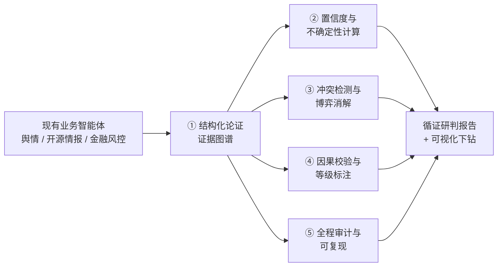
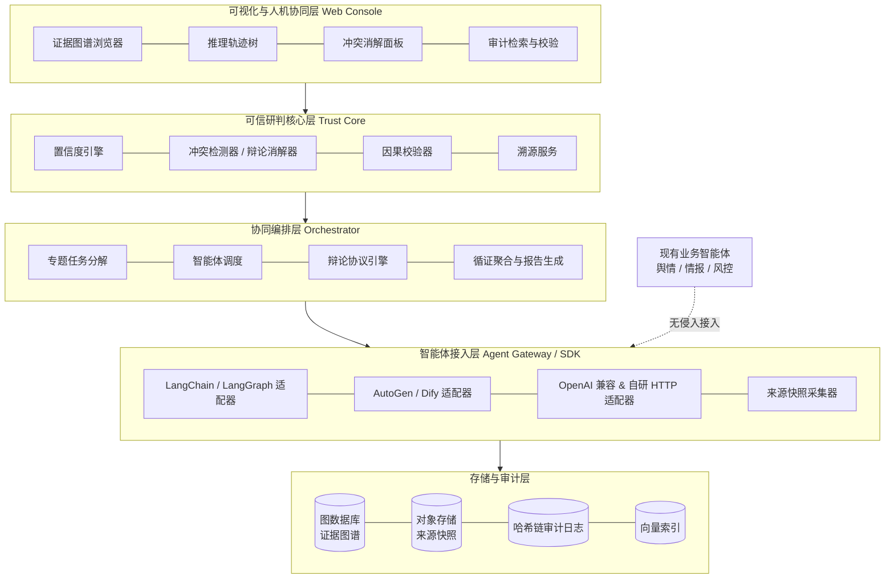
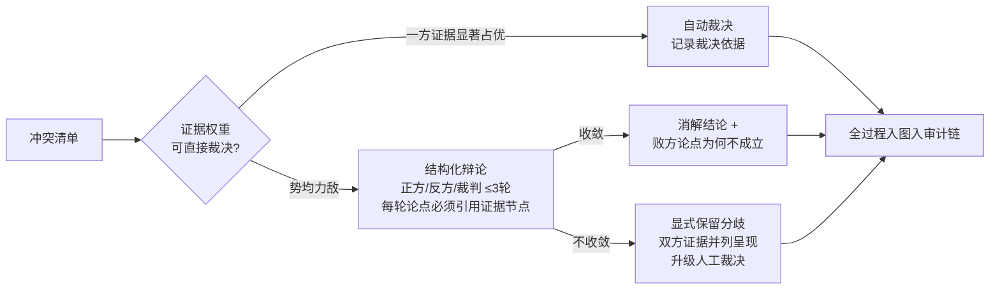
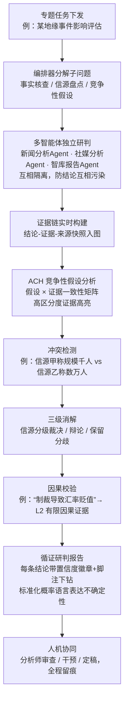
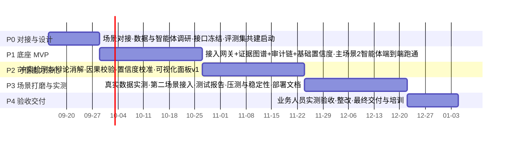

# 「明鉴」多智能体可信研判系统 · 揭榜方案

> **AI4S OPC 创新挑战赛 · 企业应用需求榜**
> 榜题编号：E-Memory（企业应用榜 · 智能体基础设施方向）
> 方案版本：v1.0 · 2026 年 9 月

---

## 〇、一页方案摘要

**核心思路：不重造智能体，而是为已部署的多智能体加装一层"可信研判底座"。**

发榜方已有覆盖舆情监测、开源情报分析、金融风控的多个研判智能体，问题不在"智能体不够"，而在"结论不可信、过程不可溯、协同不科学"。因此本方案交付的是一套**智能体基础设施**——「明鉴」可信研判底座，以**"无证据、不结论"**为第一性原则：

- 任何智能体产出的每一条结论，必须在**证据图谱**中落成「结论 ← 证据 ← 来源」的显式溯源链，来源原文快照固化、逐级可下钻；
- 每条结论从**信源、证据、逻辑**三个维度计算量化置信度，并以标准化概率语言表达不确定性；
- 多智能体结论间的冲突被**自动检测、生成冲突清单**，经"证据权重裁决 → 结构化博弈辩论 → 人工升级"三级阶梯消解；
- "X 导致 Y"类因果结论经**因果校验流水线**严格验证并标注因果证据等级，从根本上区分相关与因果；
- 全过程（每次模型调用、每步中间结论、每次人工干预）写入**哈希链审计日志**，可审计比例 100%、防篡改可验证、支持复现回放与人在环干预；
- 现有智能体通过**网关/SDK 适配器无侵入接入**，单个智能体接入成本目标 ≤ 1 人日，兼容 LangChain / LangGraph / AutoGen / Dify / 自研 HTTP 服务。

**四项交付**（可运行系统 + ≥2 智能体完整演示 + 可视化面板 + 实测测试报告）按 16 周、四个阶段落地，指标承诺见 [第七章](#七交付物与指标承诺)。

---

## 一、需求理解与设计目标

### 1.1 对三大痛点的理解

| 痛点（榜题原文） | 根因分析 | 本方案对策 |
| --- | --- | --- |
| 决策"黑箱"，逻辑与依据难以追溯，可信度缺乏支撑 | 智能体输出的是**自由文本报告**，结论、证据、来源之间没有机器可读的结构化关联，事后无法核查 | 结构化论证模型：一切研判产出强制落为证据图谱，"只给结论、不给依据"的输出被系统拒收 |
| 协同机制过于简化（独立判断 / 简单投票加权），群体优势未发挥 | 投票只聚合"立场"，不聚合"证据与推理"；缺少让智能体互相质证的协议 | 循证协同协议：独立研判 → 交叉质证 → 冲突辩论 → 循证聚合，聚合的是论证而非票数 |
| 结论冲突与错误频发，冲突难以系统识别与消解 | 冲突靠人肉发现；没有冲突的形式化表示，也就没有消解机制 | NLI 矛盾挖掘自动生成冲突清单，博弈对抗式辩论消解，消解不了的显式保留分歧并升级人工 |

### 1.2 设计目标与验收标准对齐

方案设计自始对齐榜题的评分权重：

| 评分维度 | 权重 | 本方案的直接回应 |
| --- | --- | --- |
| 场景解决度 | 35% | 以情报分析研判为主场景端到端跑通（[第五章](#五场景解决方案)），演示接入 ≥3 个真实业务智能体，发榜方业务人员可用真实专题实测 |
| 证据置信度能力 | 25% | 三维置信度模型 + 校准（[4.2](#42-置信度模型多维量化不确定性表达与校准)），冲突检测/消解全流程（[4.3](#43-冲突检测与博弈消解)），指标承诺见第七章 |
| 审计完整性 | 20% | 事件溯源 + 哈希链防篡改（[4.5](#45-推理透明全程审计与可复现)），关键操作可审计比例 100%，附带独立验证工具 |
| 落地可用性 | 20% | 无侵入适配器接入（[第六章](#六兼容性与接入方案)），接入成本 ≤1 人日，容器化一键部署，模型层支持全私有化 |

---

## 二、总体技术路线

### 2.1 路线选择：可信研判"底座"，而非再造一批智能体

发榜方的业务智能体已在运行，任何要求"推倒重来"的方案都会带来不可接受的迁移成本。本方案把可信能力做成**智能体之下的一层基础设施（middleware/底座）**：现有智能体照常工作，底座负责把它们的产出结构化、量化、对质、审计。这一选择同时命中"智能体基础设施方向"的榜题定位与"落地可用性"评分维度。

### 2.2 五条技术主线



**主线①：结构化论证与证据图谱（黑箱 → 白箱的基石）**
以 Toulmin 论证模型（主张–依据–支撑–限定–反驳）为骨架、W3C PROV 溯源本体为血统模型，定义统一的研判数据模型：`来源(Source) → 证据(Evidence) → 中间结论(Claim) → 最终研判(Judgment)`，边类型包括支持/反驳/引用/派生/因果。**每条结论至少挂接一条证据、每条证据必须绑定带内容哈希的来源快照**，否则系统拒收——这是"无证据、不结论"的工程化落点。

**主线②：多维置信度与不确定性表达**
信源维度借鉴北约情报界 Admiralty Code（信源可靠性 A–F × 信息可信性 1–6）建立信源分级注册库；证据维度评估相关性、时效、直接性、独立印证数；逻辑维度用验证器模型核查"证据是否真的蕴含结论"。多证据融合采用**主观逻辑（Subjective Logic）意见三元组（信任/不信任/不确定）**，冲突质量借鉴 D-S 证据理论显式输出"冲突度"，最终置信度经标注数据**校准**（报告 ECE 校准误差），并以 ICD 203 风格的标准化概率语言（"几乎确定 / 很可能 / 可能……"）呈现，杜绝拍脑袋的百分比。

**主线③：冲突检测与博弈消解**
用 NLI（自然语言推理）模型对同一专题下的结论做两两矛盾挖掘（小模型初筛 + 大模型仲裁边界样本），生成**结构化冲突清单**（冲突双方、冲突类型、涉事证据定位）。消解采用三级阶梯：证据权重可自动裁决的直接裁决；不能裁决的进入**结构化多智能体辩论**（正方/反方/裁判，每轮论点必须引用证据图谱节点，借鉴 Debate 与 Dung 抽象论证框架的可接受性语义）；辩论仍无法收敛的**显式保留分歧**并升级人工，绝不强行合成假共识。

**主线④：因果校验**
抽取"X 导致 Y"类因果声明，走双路校验：文本证据路（Bradford Hill 因果准则量表评审 + 主动检索反证 + 混杂因素头脑风暴）；数据路（结构化数据可得时用 DoWhy 因果图 + 反驳检验）。输出 **L1 仅相关 / L2 有限因果证据 / L3 较强因果证据 / L4 强因果证据**四级标注（参考循证医学 GRADE 分级思想），把"防范归因错误"落成可执行流程。

**主线⑤：全程审计与可复现**
事件溯源（Event Sourcing）架构：每次提示词/模型响应/工具调用/图谱变更/人工干预都是一条带全局 Trace ID 的事件，**逐条哈希链接（区块链式 prev-hash）+ 周期性 Merkle 根锚定**，配独立的 `audit verify` 校验工具，任何篡改可被数学证明。记录模型版本/参数/随机种子/检索上下文，支持复现模式回放比对；人工可在检查点暂停、修订、批注，干预本身也是一等公民事件。

### 2.3 模型与部署路线

- **模型层可插拔**：支持私有化部署开源模型（DeepSeek-V3 / Qwen 系列，vLLM 推理）与云端 API 双模式，敏感场景全量本地推理；NLI / 向量 / 重排等小模型（BGE、RoBERTa-NLI 类）本地部署并按场景微调。
- **部署形态**：Docker Compose 一键起（演示/试用）+ Kubernetes Helm Chart（生产），全部组件可离线运行。

---

## 三、系统架构设计

### 3.1 分层架构



### 3.2 核心组件职责

| 组件 | 职责 | 关键设计 |
| --- | --- | --- |
| **智能体接入网关（Agent Gateway/SDK）** | 把异构智能体的产出规范化为结构化"研判贡献"（结论+证据段落+来源引用） | 适配器模式三档接入（见第六章）；对只会输出自由文本的存量智能体提供"补建链"抽取通道 |
| **来源快照采集器** | 证据入库瞬间抓取原始网页/文档快照，计算内容哈希并固化 | 防"来源已删除/被篡改"导致断链；快照哈希写入审计链 |
| **协同编排器（Orchestrator）** | 专题分解为子问题，调度智能体**独立研判**（防互相污染），组织交叉质证与辩论，循证聚合 | 支持 ACH 竞争性假设分析编排模式（见 5.1）；聚合依据是证据权重而非票数 |
| **证据图谱库** | 存储 Source/Evidence/Claim/Judgment/Agent/Task 节点与支持/反驳/引用/派生/因果边 | Neo4j / NebulaGraph；图谱质量自检：孤儿结论、断链、循环支持检测 |
| **置信度引擎** | 信源×证据×逻辑三维评分、主观逻辑融合、沿图传播、校准 | 详见 4.2 |
| **冲突检测/辩论消解器** | 矛盾挖掘→冲突清单→三级阶梯消解→消解记录入图 | 详见 4.3 |
| **因果校验器** | 因果声明抽取→双路校验→L1–L4 等级标注 | 详见 4.4 |
| **审计链** | 全事件哈希链日志、防篡改校验、复现回放 | 详见 4.5 |
| **可视化控制台** | 四大面板 + 人工干预入口 | React + AntV G6 图可视化，详见 4.6 |

### 3.3 证据图谱数据模型（核心 Schema）

```text
(:Source {url, title, publisher, publish_time, snapshot_hash, admiralty_grade})
(:Evidence {text_span, extracted_at, directness, timeliness, relevance_score})
(:Claim {statement, type: 事实|因果|评价|预测, confidence, uncertainty, causal_level})
(:Judgment {report_id, statement, confidence, estimative_language})
(:Agent {agent_id, framework, capability_tags, historical_accuracy})
(:DebateRecord {rounds, verdict, rationale})

(Evidence)-[:EXTRACTED_FROM {offset}]->(Source)
(Claim)-[:SUPPORTED_BY {weight, opinion(b,d,u)}]->(Evidence)
(Claim)-[:REFUTED_BY {weight}]->(Evidence)
(Claim)-[:DERIVED_BY {step_no, reasoning}]->(Agent)
(Claim)-[:CONFLICTS_WITH {type, status}]->(Claim)
(Claim)-[:CAUSES {causal_level: L1..L4, hill_scores}]->(Claim)
(Judgment)-[:AGGREGATES]->(Claim)
```

任何一个最终研判结论，都可以沿 `Judgment → Claim → Evidence → Source(快照)` 逐级下钻到原文——这正是榜题要求的"结论 ← 证据 ← 来源"全程可溯。

### 3.4 技术选型

| 层 | 选型 | 备注 |
| --- | --- | --- |
| 大模型 | DeepSeek / Qwen（vLLM 私有化）或云 API | 可插拔，按发榜方安全要求配置 |
| 小模型 | BGE 向量/重排、RoBERTa-NLI 类矛盾检测（微调） | 本地推理，控制成本与时延 |
| 图存储 | Neo4j 或 NebulaGraph | 证据图谱与图算法（传播、路径下钻） |
| 检索 | Elasticsearch + 向量索引 | 证据归因与反证检索 |
| 审计 | 事件溯源存储 + SHA-256 哈希链 + Merkle 锚定 | 可选对接 RFC3161 时间戳服务 |
| 编排 | 自研轻量编排内核，兼容 OpenTelemetry Trace 语义 | 与现有链路追踪体系可对接 |
| 前端 | React + AntV G6 / Cytoscape | 图谱与推理树可视化 |
| 部署 | Docker Compose / Helm | 一键部署 + 部署文档 |

---

## 四、关键技术方案

### 4.1 证据链自动构建

**双通道构建，覆盖增量与存量：**

1. **原生链（推荐）**：接入 SDK 要求智能体按结构化协议提交研判贡献——每条结论附证据文本段与来源引用。SDK 内置强制校验：无证据的结论被拒收并要求补证。适用于可加回调/中间件的智能体。
2. **补建链（兜底）**：对只能输出自由文本报告的存量智能体，走后置抽取流水线：结论抽取 → 证据归因（在其检索上下文中匹配支撑段落）→ 来源绑定 → 验证器复核蕴含关系。补建链在图谱中带"补建"标记，与原生链区分展示，保证诚实。

**来源固化**：证据入库即抓取来源快照（网页存档/文档副本），计算 SHA-256 内容哈希入审计链。结论下钻到底时看到的是**固化时刻的原文**，而非可能已被修改的活链接。

**图谱质量自检**：定时任务检测孤儿结论（无证据）、断链（快照缺失）、循环支持（A 支持 B、B 支持 A 的自我印证），生成整改工单。

### 4.2 置信度模型：多维量化、不确定性表达与校准

**第一维·信源可信度**：建立信源注册库，按 Admiralty Code 双轴分级（可靠性 A–F：以历史准确率、机构属性、专业领域初始化；可信性 1–6：按单条信息与其他信源的印证情况评定）。信源历史表现通过贝叶斯更新持续学习——某信源被多次证伪，其先验自动下调。

**第二维·证据质量**：相关性（向量召回 + 重排器打分）、时效性（时间衰减函数）、直接性（一手/二手/转述）、**独立印证数**——特别地，先对近重复报道聚类去重，同一通稿被转载一百次只算一个独立信源，防"通稿灌水"虚增可信度。

**第三维·逻辑有效性**：验证器模型独立核查"该证据是否真的蕴含该结论"（蕴含/中立/矛盾三分类），并过一遍常见逻辑谬误清单（以偏概全、诉诸权威、时序倒置等）。

**融合与传播**：每条"证据→结论"边表示为主观逻辑意见 ω=(信任 b, 不信任 d, 不确定 u)，多证据用共识算子融合；支持与反驳证据并存时，借鉴 D-S 理论显式计算并输出**冲突度 K**（冲突度高本身就是重要研判信号）。置信度沿图谱边传播：下游结论的置信度受上游证据链约束，改一处来源评级，全图相关结论置信度自动重算。

**校准与表达**：用与发榜方共建的标注评测集做校准（温度缩放），报告 ECE / Brier 分数；输出层采用 ICD 203 风格标准化概率语言 + 数值区间（如"很可能（70–85%）"），并强制展示不确定来源（信源单薄 / 证据冲突 / 逻辑链弱）。

### 4.3 冲突检测与博弈消解

**检测**：同一专题下的结论按实体/事件分桶（控制两两比较规模），桶内用微调 NLI 小模型初筛矛盾对，边界样本交大模型仲裁。产出**冲突清单**：冲突双方结论、冲突类型（事实矛盾 / 数值不一致 / 因果分歧 / 评价分歧）、双方证据定位、涉及智能体。——对应榜题"自动识别多智能体结论冲突并定位清单"。

**三级消解阶梯**：



- **自动裁决**：一方在信源等级、独立印证数、证据直接性上显著占优时直接裁决，裁决依据结构化记录。
- **博弈辩论**：正方/反方智能体各执一词，≤3 轮质证与反驳，**每条论点必须引用证据图谱节点**（裁判对无证据论点直接判负）；裁判由独立模型（或小型评审团多数决）按预置量表（证据强度/逻辑严密/反驳有效）打分。辩论全程入图，形成 DebateRecord。
- **人工升级**：不收敛的冲突绝不粉饰——保留分歧、并列呈现双方证据链，推送人工裁决队列；人工裁决同样入审计链。

**效果度量**：冲突检出率、消解结论与领域专家判定的一致率（即榜题的"冲突消解成功率"），指标承诺见第七章。

### 4.4 因果推断与校验

**抽取**：规则模板（导致/引发/因为/使得……）+ 大模型识别，把报告中的因果声明"X→Y"显式化为图谱因果边候选。

**双路校验**：

- **文本证据路（主路）**：评审面板按 Bradford Hill 准则量表逐项打分——时序性（X 先于 Y？）、关联强度、多源一致性、剂量-反应、机制合理性、混杂排查；同时执行**主动反证检索**（专门检索"X 不导致 Y"、"Y 另有原因"的证据）与混杂因素头脑风暴（Z 同时导致 X 和 Y？）。
- **数据路（结构化数据可得时）**：DoWhy 构建因果图，做识别、估计与反驳检验（安慰剂处理、随机共因、子集检验）。

**输出**：因果边标注四级等级——**L1 仅相关（禁止表述为因果）/ L2 有限因果证据 / L3 较强因果证据 / L4 强因果证据**，附各准则得分与反证情况。报告生成器按等级强制措辞：L1 只能写"与……相关"，写"导致"会被拦截改写。这把"区分相关与因果、防范归因错误"从口号变为流水线上的硬约束。

### 4.5 推理透明、全程审计与可复现

- **推理轨迹**：编排器捕获每一步的输入、中间结论、依据与逻辑说明，组织为**推理树**（节点=中间结论，边=推理步骤），与证据图谱互链；思维链形式随报告输出。
- **事件溯源 + 哈希链**：每条事件（提示词、模型响应、工具调用、图谱变更、辩论轮次、人工干预）带全局 Trace ID 与时间戳，`hash_n = SHA256(event_n ∥ hash_{n-1})` 逐条链接，周期性计算 Merkle 根锚定（可选对接可信时间戳）。提供独立 `audit verify` CLI：任何一条日志被事后篡改都会导致链校验失败——"日志不可篡改"由密码学保证而非口头承诺。
- **100% 覆盖**：审计埋点内置于网关与编排器（而非依赖各智能体自觉），凡经过底座的关键操作必然留痕，可审计比例 100%。
- **可复现**：记录模型标识与版本、采样参数、随机种子、检索上下文快照；复现模式重放整个研判流程并输出与原始运行的差异对比。
- **可干预**：人工可在专题级/结论级设置检查点，暂停、修订结论、补充证据、否决辩论裁决；每次干预以一等公民事件入链，报告中显式标注"含人工干预"。

### 4.6 可视化面板（对应交付要求第 3 项）

| 面板 | 内容 |
| --- | --- |
| **证据图谱浏览器** | 从最终研判逐级下钻：结论 → 证据 → 来源快照原文高亮；支持/反驳边着色；置信度热力着色；一键导出证据包 |
| **推理轨迹树** | 每个智能体与编排器的推理树/时间线，节点展开看中间结论与依据；标注人工干预点 |
| **冲突消解面板** | 冲突清单看板（待消解/辩论中/已消解/保留分歧）、辩论回放（逐轮论点与引用证据）、人工裁决工作台 |
| **审计与校验** | 按 Trace ID / 时间 / 智能体检索事件流；在线运行哈希链校验并出具校验报告；复现回放入口 |

---

## 五、场景解决方案

> 榜题正文列出场景一（情报分析研判）；结合需求背景中"舆情监测、开源情报分析、金融风控"三类已部署场景，本方案以**场景一为主场景做端到端深度实现**，并从需求背景中选取**金融风控研判作为第二场景**验证底座的跨场景通用性（具体第二场景可在对接阶段按发榜方优先级调整为舆情监测）。

### 5.1 场景一：情报分析研判（主场景，深度实现）

**现状痛点回顾**：信源驳杂且可信度差异大、同一事件信源矛盾；分析依赖个人经验、主观性强、可复现性弱；多源汇聚时冲突难以系统识别与消解；"只给结论、不给依据"。

**循证研判工作流**：



**方案要点**：

1. **独立研判防串谋**：各智能体先在隔离上下文中独立形成结论（借鉴情报分析"独立评估"纪律），再进入交叉质证——避免"先发言者带偏全场"的从众效应，这是对"简单投票"协同范式的根本升级。
2. **ACH 竞争性假设编排**：对开放性研判问题，编排器生成竞争性假设集，各智能体对"假设 × 证据"矩阵独立评分（一致/矛盾/无关），系统自动标出**高区分度证据**（能证伪多数假设的关键证据）并计算各假设的存活强度——把 Heuer 的经典情报分析方法工程化，直接服务"人机协同、证据驱动"的循证范式。
3. **矛盾信源的系统化处理**：同一事件的矛盾信息不再靠分析师记忆力发现，NLI 自动挖掘 + 冲突清单定位 + 信源分级裁决/辩论消解；无法消解的，报告中并列呈现双方证据与置信度，把"含糊"变成"可度量的分歧"。
4. **交付形态**：分析师看到的最终报告，每条结论带置信度徽章与脚注，点击即下钻证据链直至原文快照——为决策者提供"知其然更知其所以然"的情报产品。

**演示设计（对应交付要求第 2 项）**：接入 ≥3 个智能体（新闻分析、社媒分析、智库报告分析；其中至少一个用发榜方现有智能体原样接入以证明兼容性），使用发榜方提供的真实业务数据跑 2–3 个真实专题，由发榜方业务人员实测验收（对应"场景解决度 35%"）。

### 5.2 场景二：金融风控研判（跨场景通用性验证）

**任务示例**：对某企业信用风险等级做多智能体研判——财报分析智能体、涉诉记录智能体、关联图谱智能体、舆情智能体各自独立出具意见。

**底座价值的直接映射**：

- **冲突消解**："财报稳健"（财报 Agent）vs "供应商集中曝出欠款传闻"（舆情 Agent）——自动检出冲突，按信源等级（审计报告 A2 vs 匿名爆料 E4）与证据直接性裁决或辩论，避免简单加权把关键弱信号平均掉。
- **因果校验**："营收下滑导致违约风险上升"须过因果流水线：数据路用历史结构化数据做 DoWhy 反驳检验，文本路排查行业周期等混杂因素，标注因果等级后才准进入结论。
- **监管级审计**：风控结论天然面临合规审查，哈希链审计与证据下钻使每一个风险评级"可向监管解释"——审计完整性能力在该场景兑现为直接业务价值。

该场景复用底座全部能力，仅需按第六章接入方式适配 2 个风控智能体与其数据源，验证"一套底座、多场景通用"。

---

## 六、兼容性与接入方案（落地可用性 20%）

**三档接入，按侵入度递减：**

| 档位 | 方式 | 适用 | 接入成本 |
| --- | --- | --- | --- |
| A. SDK 深度接入 | Python/HTTP SDK，智能体在推理过程中实时提交结构化研判贡献 | 可改造的自研智能体 | 1–2 人日 |
| B. 框架适配器 | LangChain/LangGraph 回调、AutoGen 钩子、Dify 插件，自动捕获中间步骤 | 主流框架构建的智能体 | ≤1 人日 |
| C. 网关代理（无侵入） | 智能体只需把最终报告经 OpenAI 兼容接口/HTTP 提交，底座走"补建链"通道 | 黑盒/遗留智能体 | ≤0.5 人日 |

- **协议标准**：对外暴露 OpenAI 兼容 API 与 MCP（Model Context Protocol）接口，编排追踪采用 OpenTelemetry 语义，便于并入发榜方现有可观测体系。
- **稳定性**：核心链路无状态可横向扩展；辩论仅在检出冲突时触发（触发式而非常态化，控制成本与时延）；NLI 初筛用本地小模型，大模型只处理仲裁与辩论，压测目标见第七章。
- **私有化**：全组件可离线部署，模型层支持全本地推理，满足涉敏数据不出域。

---

## 七、交付物与指标承诺

**四项交付对照榜题：**

1. **可运行系统**：容器化交付（Compose/Helm），附部署文档、使用说明、运维手册；
2. **≥2 个智能体完整演示**：实际计划接入 ≥3 个（含至少 1 个发榜方现有智能体原样接入），覆盖第五章场景；
3. **可视化面板**：证据图谱浏览器 + 推理轨迹树 + 冲突消解面板 + 审计校验四大面板（超出榜题要求的前两项）；
4. **测试报告**：与发榜方共建评测集（真实业务数据标注），实测下列指标。

**指标承诺（目标值，最终以联合评测集实测为准）：**

| 指标 | 目标值 | 对应评分维度 |
| --- | --- | --- |
| 溯源完整率（每条结论可下钻至来源快照） | 100%（结构性保证） | 场景解决度 / 审计完整性 |
| 证据链构建准确率（结论–证据关联正确性，人工抽检） | ≥ 85% | 证据置信度能力 |
| 置信度校准误差 ECE | ≤ 0.10 | 证据置信度能力 |
| 冲突检出率（对标注冲突集） | ≥ 90% | 证据置信度能力 |
| 冲突消解成功率（与专家判定一致） | ≥ 80% | 证据置信度能力 |
| 因果声明校验覆盖率（报告中因果表述均带等级标注） | 100%（结构性保证） | 场景解决度 |
| 关键操作可审计比例 | 100%，哈希链校验通过 | 审计完整性 |
| 单智能体接入成本 | ≤ 1 人日（B/C 档） | 落地可用性 |
| 稳定性 | 7×24 试运行 ≥ 2 周无重大故障；单专题研判端到端时延满足业务要求（对接阶段约定 SLO） | 落地可用性 |

---

## 八、实施计划（16 周）



| 阶段 | 周次 | 里程碑（可验证的出口标准） |
| --- | --- | --- |
| **P0 对接与设计** | 1–2 | 场景与数据界面确认；现有智能体框架清单与接入档位评估；接口规格冻结；评测集标注方案与首批标注启动 |
| **P1 底座 MVP** | 3–6 | 主场景 2 个智能体端到端跑通：结论全部入图、可下钻至来源快照、审计链可校验——先把"无证据、不结论"立起来 |
| **P2 可信能力深化** | 7–10 | 冲突清单与三级消解上线；因果等级标注上线；置信度完成首轮校准；可视化面板 v1 可演示 |
| **P3 场景打磨与实测** | 11–14 | 第二场景接入完成；评测集实测出数（第七章各指标）；压测与 2 周试运行启动；部署与使用文档定稿 |
| **P4 验收交付** | 15–16 | 发榜方业务人员真实专题实测；问题整改；系统+文档+测试报告正式交付与培训 |

**团队分工**（≥2 人，建议 5 人配置）：系统架构与编排（1）、多智能体与置信度/冲突算法（1–2）、因果推断与评测（1）、前端可视化（1）、场景对接与测试（1，可兼）。

---

## 九、风险与对策

| 风险 | 对策 |
| --- | --- |
| 大模型幻觉污染证据关联 | "无证据、不结论"硬约束 + 独立验证器复核蕴含关系 + 来源快照固化；补建链显式标记，不冒充原生链 |
| 信源可信度先验冷启动 | 与发榜方共建信源注册库，先按机构类型/历史表现初始化，运行中贝叶斯更新；先验与更新记录全部可审计 |
| 纯文本场景因果校验的固有局限 | 不承诺"证明因果"，承诺"因果证据分级 + 强制措辞约束 + 主动反证检索"——把归因错误的风险显式化、可管理 |
| 辩论机制的算力/时延开销 | 触发式辩论（仅冲突且证据权重无法裁决时）；小模型初筛 + 大模型仲裁的分层调用；轮次上限 3 轮 |
| 与存量智能体兼容性不确定 | 三档接入兜底（最差走无侵入网关代理）；P0 阶段即做接入档位摸底，风险前置 |
| 评测标准理解偏差 | P0 与发榜方共建评测集与验收口径，指标定义（如"冲突消解成功率"的判定人）书面冻结 |

---

## 十、揭榜条件响应

| 揭榜条件 | 响应 |
| --- | --- |
| 具备多智能体系统、因果推断、可信 AI 相关研发能力 | 团队具备多智能体编排、论证与不确定性计算（主观逻辑/D-S）、因果推断（DoWhy/准则评审）、可信 AI 审计工程实践（按团队实际情况补充成员简历与代表成果） |
| 团队 ≥ 2 人 | 建议 5 人配置（见第八章），满足下限要求 |
| 提交方案摘要 | 即本文档：技术路线（第二章）、架构设计（第三、四章）、场景解决方案思路（第五章）、实施计划（第八章） |

---

*本方案为揭榜阶段方案摘要，具体实施细节（评测集规模、SLO、第二场景选择、私有化模型选型等）在"揭榜 → 论证 → 对接"阶段与发榜方共同细化冻结。*
